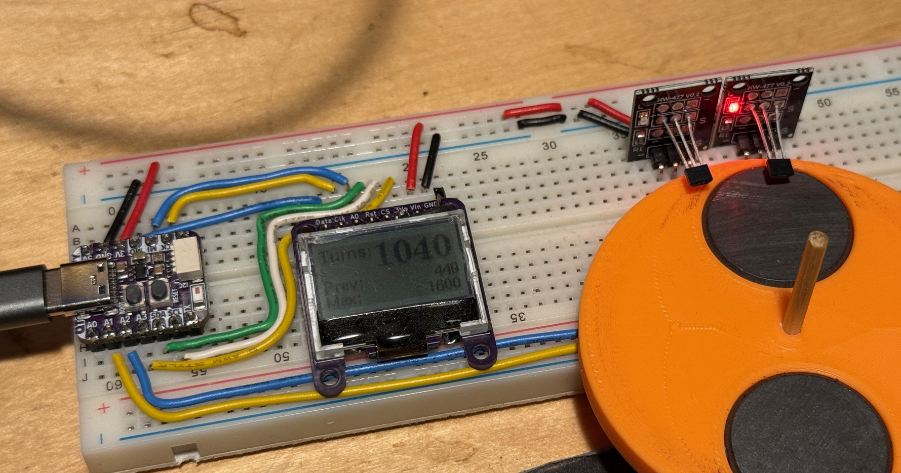

# Rubber Band Winder Turns Counter

A turns counter for 3D-printed model airplane rubber band winders. Uses two hall effect sensors to count shaft rotations with direction detection, displayed on a small COG LCD.



## Hardware

| Component                                                                                                       | Description                                                                                                    |
| --------------------------------------------------------------------------------------------------------------- | -------------------------------------------------------------------------------------------------------------- |
| [Adafruit QT Py ESP32-C3](https://www.adafruit.com/product/5405)                                                | Microcontroller board                                                                                          |
| [ERC12864FSF-11](https://www.buydisplay.com/0-96-inch-low-cost-white-128x64-graphic-cog-lcd-display-st7567-spi) | 128x64 COG LCD (ST7567 controller) on [custom breakout board](../../../COGDisplayBreakout/COGDisplayBreakout/) |
| 2x KY-003                                                                                                       | Hall effect sensor modules (left and right)                                                                    |
| Magnet                                                                                                          | Mounted on the winder output shaft                                                                             |

### Pin Mapping

| Function            | QT Py Pin | ESP32-C3 GPIO |
| ------------------- | --------- | ------------- |
| Hall sensor - left  | A2        | 1             |
| Hall sensor - right | A1        | 3             |
| Button (BOOT)       | BOOT      | 9             |
| NeoPixel            | -         | 2             |
| Display SCK         | SCK       | 10            |
| Display SDA         | MO        | 7             |
| Display CS          | SCL       | 6             |
| Display DC          | MI        | 8             |
| Display RST         | SDA       | 5             |
| Backlight LED       | A3        | 0             |

## Features

### Turn Counting

Two KY-003 hall effect sensors detect a magnet on the rotating shaft. The left sensor triggers an interrupt; at that moment the right sensor is read to determine direction:

- Left sensor activates first: count increments (winding)
- Right sensor activates first: count decrements (unwinding)

### Display

The 128x64 LCD shows three values:

- **Turns** - current count (large font)
- **Prev** - count saved from last reset
- **Max** - maximum turns set point

### Button (BOOT)

- **Short press** (normal mode): saves current count to "Prev" and resets count to zero
- **Short press** (set-mode): exits set-mode
- **Long press** (3 seconds): enters set-mode, where turning the crank adjusts the max turns value by +/-10 per turn. The max value flashes on the display while in set-mode.

### Warnings

As the absolute turn count approaches the max set point:

- **80%**: NeoPixel flashes yellow
- **90%**: NeoPixel flashes red, backlight flashes

Warnings trigger regardless of winding direction since rubber bands break under strain in either direction.

### Backlight Sleep

The backlight turns off after 1 minute of inactivity (no turns or button presses) and turns back on automatically when activity resumes. The LCD remains readable without the backlight in good lighting.

## Building

### Dependencies

Install these via the Arduino IDE Library Manager:

- [U8g2](https://github.com/olikraus/u8g2) - display graphics
- [Adafruit NeoPixel](https://github.com/adafruit/Adafruit_NeoPixel) - RGB LED control

### Board Setup

1. In Arduino IDE, install the ESP32 board support package
2. Select board: **Adafruit QT Py ESP32-C3**
3. Open `ERC12864_TurnsCounter/ERC12864_TurnsCounter.ino`
4. Compile and upload

### Troubleshooting

- **Direction inverted**: swap `HALL_LEFT` and `HALL_RIGHT` pin definitions
- **Double-counting**: increase `DEBOUNCE_MS` (default 10)
- **Missing counts at speed**: decrease `DEBOUNCE_MS`
- Serial monitor at 115200 baud prints turn counts and button events

## Repository Structure

```
ERC12864_TurnsCounter/   Current sketch (QT Py ESP32-C3 + ERC12864 LCD)
TurnsCounter/            Original reference sketch (ATmega + SSD1306 OLED)
JulianCode/              Reference: low-level SSD1306 OLED control
PinChangeInterrupts/     Reference: AVR pin-change interrupts
U8libExample/            Reference: U8glib display example
SoftServoExample/        Reference: Adafruit Trinket servo control
blinknodelay/            Reference: non-blocking blink pattern
Documents/               Datasheets (QT Py, hall effect sensors, displays)
STLs/                    3D printed parts (magnet disk for shaft)
```

## Future Plans

- LiPo battery support via [Adafruit LiPo Charger BFF](https://www.adafruit.com/product/5397) (note: A2 pin conflict with hall sensor will require rewiring)
- Deep sleep mode with NVS save/restore of turn count
- Progress bar on display
- Custom PC board to replace the breadboard wiring
- Battery charge indicator
